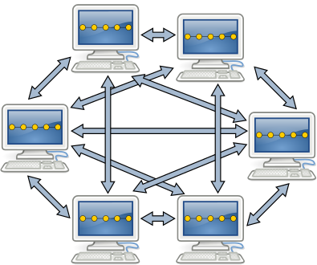

# Laboratorio 7: Operazioni con repository remoti

## Creare e Importare un Repository

Abbiamo detto che in Git possiamo inizializzare un repository vuoto usando il comando:

```bash
git init
```

Questo comando crea un nuovo repository nella cartella corrente, ma sarà vuoto, senza alcun file, storia, o contenuto. **Questo approccio è utile** quando vogliamo iniziare un progetto da zero. Tuttavia, nella maggior parte dei casi, lavoriamo su progetti che esistono già, magari su un server remoto, quindi dobbiamo copiare un repository esistente nel nostro computer per lavorarci sopra.

### Clonare un Repository

**Per creare una copia di un repository esistente nel nostro sistema**, Git ci mette a disposizione il comando `git clone`. Con questo comando, possiamo copiare l’intera storia del repository (tutti i commit, le modifiche, e i rami) nel nostro sistema. La sintassi è la seguente:

```bash
git clone <URI> <destination>
```

Dove:

- `URI` rappresenta l’indirizzo del repository remoto o locale da clonare.
- `destination` è il nome della cartella in cui verrà salvata la copia locale del repository.

Se non specifichiamo `destination`, Git creerà automaticamente una cartella usando l’ultimo segmento dell’URI.

**Esempi di utilizzo**:

- Clonare un repository locale:

  ```bash
  git clone /some/repository/on/my/file/system destination
  ```

  Questo crea una cartella chiamata `destination` e copia il repository dal percorso specificato sul nostro file system locale.

- Clonare un repository remoto via HTTPS:

  ```bash
  git clone https://somewebsite.com/someRepository.git myfolder
  ```

  Questo crea una cartella chiamata `myfolder` e copia il repository dal server remoto all’indirizzo specificato.

- Clonare un repository remoto via SSH:

  ```bash
  git clone user@sshserver.com:SomePath/SomeRepo.git
  ```

  In questo caso, la cartella avrà il nome `SomeRepo` e conterrà la copia del repository.

> **Nota**: quando usiamo il protocollo SSH (`user@sshserver.com:SomePath/SomeRepo.git`), la connessione è cifrata, quindi è più sicuro e preferibile quando possibile.

## Remoti e Repository Clonati

Dopo aver clonato un repository, si crea automaticamente un cosiddetto **remote**. I **remoti** sono versioni conosciute del repository che esistono altrove, solitamente su internet o in un altro server. Il **remote** creato automaticamente al momento della clonazione è chiamato `origin`, ed è semplicemente il nome predefinito per il collegamento al repository da cui abbiamo clonato.

### Visualizzare i Remoti

Per vedere l’elenco dei remoti conosciuti, possiamo usare:

```bash
git remote -v
```

Questo comando mostra tutti i remoti e i relativi URI. Se volessimo **aggiungere un nuovo remote** per connetterci a un altro repository, potremmo farlo con:

```bash
git remote add <nome-remote> <URI>
```

Ad esempio, per aggiungere un nuovo remote chiamato `a-remote`:

```bash
git remote add a-remote https://someserver.com/someotherrepository.git
```

**Per eliminare un remote**:

```bash
git remote remove <nome-remote>
```

Questo comando non elimina il repository remoto ma rimuove solo il riferimento locale.

## I Rami e l’Upstream

Quando cloniamo un repository, **Git crea un collegamento tra il ramo principale del repository locale e quello remoto**, impostando il cosiddetto **`upstream`**. Per impostazione predefinita, Git sceglie il branch principale (solitamente `master` o `main`) come quello da cui cominciare a lavorare. Questo significa che il branch principale locale viene collegato automaticamente al ramo `origin/master` (l’origine è il remote che abbiamo creato).

### Configurare un Upstream Manualmente

Possiamo anche configurare manualmente un upstream. Immaginiamo di voler associare un nostro ramo locale chiamato `develop` al ramo `develop` su `origin`. Useremo il comando:

```bash
git branch --set-upstream-to=origin/develop
```

In questo modo, ogni volta che lavoriamo sul ramo `develop`, Git saprà che il suo “punto di riferimento” è il ramo `develop` su `origin`.

### Esempio Dettagliato di Clonazione

Quando eseguiamo un comando come:

```bash
git clone git@somesite.com/repo.git
```

Git esegue una serie di azioni:

- Scarica il repository `repo.git` da `somesite.com` e crea una cartella `repo` (dal nome dell’ultima parte dell’URI).
- Il remote `origin` viene creato e viene configurato per puntare a `git@somesite.com/repo.git`.
- Git controlla il ramo principale del repository (`master`, in questo esempio) e lo collega al ramo `origin/master`.
- Git “vede” anche gli altri rami esistenti (`feat/serverless`, `dev`, ecc.) ma non li controlla attivamente. Essi verranno scaricati e visualizzati solo quando eseguiamo determinati comandi.


*Immagine 1: Il risultato del comando `git clone git@somesite.com/repo.git`*

## Visualizzare i Rami Remoti

Infine, per visualizzare tutti i rami locali e remoti, possiamo usare:

```bash
git branch -a
```

Mentre per ottenere un rapido riassunto della cronologia di commit di tutti i rami:

```bash
git log --oneline --graph --all
```

Questi comandi ci permettono di vedere visivamente le connessioni e le differenze tra i rami locali e remoti, aiutandoci a mantenere traccia delle modifiche e della storia del progetto.

## Importare Branch Remoti

Quando abbiamo branch su repository remoti e vogliamo lavorarci localmente, possiamo portarli nel nostro ambiente locale con alcuni comandi Git, in particolare `git branch` o `git checkout`. Questi comandi permettono di creare versioni locali dei branch remoti, pronte per lo sviluppo.

### Esempio: Creare un Branch Locale da un Branch Remoto

Immaginiamo di avere un branch remoto chiamato `origin/feat/serverless`.


*Immagine 2: Il branch remoto `origin/feat/serverless`*

Per lavorare su questo branch localmente, possiamo usare il comando `git checkout -b` per creare un nuovo branch locale e impostare `origin/feat/serverless` come upstream:

```bash
git checkout -b imported-feat origin/feat/serverless
```

Cosa succede:

1. Viene creato un nuovo branch locale chiamato `imported-feat`.
2. Questo branch locale è collegato al branch remoto `origin/feat/serverless`, semplificando la sincronizzazione delle modifiche tra i due.
3. La directory di lavoro passa automaticamente al branch `imported-feat`, e quindi tutte le modifiche successive si applicano su questo branch a meno che non lo cambiamo di nuovo.


*Immagine 3: Creazione del branch `imported-feat`*

## Workflow Semplificato con Tracciamento Automatico dei Branch in Git

Le versioni più recenti di Git semplificano ulteriormente questo processo se non ci sono conflitti nei nomi dei branch. Per esempio, se vogliamo lavorare sul branch `feat/new-client` da `origin`, possiamo usare il seguente comando senza specificare esplicitamente il branch remoto:

```bash
git checkout feat/new-client
```

Se non esiste già un branch locale chiamato `feat/new-client` e non ci sono branch con lo stesso nome in altri remoti, Git:

1. Crea automaticamente un branch locale chiamato `feat/new-client`.
2. Imposta come upstream il branch remoto `origin/feat/new-client`.

Questa semplificazione accelera il flusso di lavoro, soprattutto se si lavora con un singolo repository remoto.

## Lavorare con Più Remoti

Quando collaboriamo su diversi repository, potremmo dover lavorare con più remoti, ovvero copie diverse dello stesso repository in varie posizioni. Ogni remoto rappresenta una copia diversa o una posizione diversa del repository, ciascuna con i propri branch. Vediamo come gestire e passare tra branch su diversi remoti.

### Aggiungere e Accedere a un Secondo Repository Remoto

Supponiamo di avere il seguente caso di un progetto in Git.


*Immagine 4: Il risultato del comando `git remote add other git@somewhereelse.org/repo.git`*

Eseguendo il comando `git clone git@somesite.com/repo.git`, avremo:


*Immagine 5: Il risultato del comando `git clone git@somesite.com/repo.git`*

Eseguendo il comando `git checkout -b feat/serverless origin/feat/serverless`, avremo:


*Immagine 6: Il risultato del comando `git checkout -b feat/serverless origin/feat/serverless`*

Ora vogliamo aggiungere un altro repository, ad esempio `somewhereelse.org/repo.git`. Lo aggiungiamo con il comando `git remote add`:

```bash
git remote add other git@somewhereelse.org/repo.git
```


*Immagine 7: Il risultato del comando `git remote add other git@somewhereelse.org/repo.git`*

Ora Git riconosce due remoti:

- `origin`, collegato a `somesite.com/repo.git`.
- `other`, collegato a `somewhereelse.org/repo.git`.

Con più remoti, Git ci permette di interagire con ciascuno separatamente. Possiamo quindi ottenere aggiornamenti, elencare branch, o creare nuovi branch basati su uno o sull’altro remoto.

### Esempio: Creare un Branch Locale da un Remoto Diverso

Dopo aver aggiunto un secondo remoto, supponiamo di voler lavorare su un branch chiamato `master` da `somewhereelse.org`. Creiamo un nuovo branch locale chiamato `other-master` e lo impostiamo per seguire `other/master` con:

```bash
git checkout -b other-master other/master
```


*Immagine 8: Il risultato del comando `git remote add other git@somewhereelse.org/repo.git`*

Ecco cosa fa il comando:

1. `git checkout -b other-master` crea un nuovo branch locale chiamato `other-master`.
2. `other/master` viene impostato come upstream per `other-master`, collegandolo a `somewhereelse.org`.

Con questa configurazione, Git rende semplice sia ottenere le modifiche da `other/master` su `other-master` che inviare le nostre modifiche locali a `somewhereelse.org` quando necessario.

## Operare con Più Remoti

Lavorare con più remoti in Git permette di sincronizzare e gestire repository multipli per scopi come collaborazioni distribuite o backup in vari server. Vediamo come gestire questo scenario, come eseguire il fetch e il merge delle modifiche e come inviare aggiornamenti locali ai vari remoti.

In un contesto con più remoti, è importante utilizzare nomi di branch unici per ciascun repository, evitando conflitti di nomi locali. Per seguire due branch `master` (uno su `origin` e uno su `anotherRemote`), dovremmo creare due branch locali con nomi diversi, come `origin-master` e `another-master`, ognuno dei quali traccia rispettivamente `origin/master` e `anotherRemote/master`.

```bash
# Creazione e tracking del branch di `origin`
git checkout -b origin-master origin/master

# Creazione e tracking del branch di `anotherRemote`
git checkout -b another-master anotherRemote/master
```

### Eseguire il Fetch delle Modifiche dai Remoti

Il comando `git fetch` consente di controllare se sono disponibili aggiornamenti in un remoto specifico. Usato in questa forma, `git fetch` non modifica alcun branch locale, ma aggiorna le informazioni sui branch remoti nella repository locale:

```bash
# Controlla gli aggiornamenti in un remoto specifico, ad esempio `a-remote`
git fetch a-remote
```

Se si esegue `git fetch` senza specificare un remoto:

- Se `HEAD` è collegato a un branch che ha un upstream, Git eseguirà il fetch del remoto che ospita il branch upstream.
- Altrimenti, Git eseguirà il fetch di `origin` (se presente).

Dopo un fetch, le informazioni aggiornate includeranno eventuali nuovi commit, branch o tag. Per vedere queste modifiche, possiamo usare:

```bash
# Visualizza tutti i branch locali e remoti
git branch -a

# Visualizza la storia di tutti i cloni del repository, incluso l'upstream
git log --oneline --graph --all
```

### Esempio di Fetch e Merge

Immaginiamo di avere un repository con il branch `master` su `origin`.


*Immagine 9: Un repository con il branch `master` su `origin`*


*Immagine 9-2: Un repository con il branch `master` su `origin` (modificato)*

Se facciamo un fetch delle modifiche e vogliamo unire (merge) il branch remoto `origin/master` al nostro branch locale `master`, il flusso di lavoro sarà simile a questo:

```bash
# Fetch per aggiornare il branch remoto
git fetch origin

# Merge delle modifiche nel branch locale master
git merge origin/master
```


*Immagine 9-3: Un repository con il branch `master` su `origin` (merged)*

Se non ci sono conflitti, Git può eseguire un "fast-forward", aggiornando `master` senza la necessità di un commit di merge. In presenza di conflitti, Git richiederà di risolverli prima di completare il merge.

### Eseguire il Pull dei Branch Remoti

`git pull` è un comando comune che combina `git fetch` e `git merge` in un’unica operazione. È utile per aggiornare rapidamente il branch locale con le ultime modifiche dal branch remoto upstream:

```bash
# Esegue fetch e merge su un remoto e branch specifici
git pull origin master
```

`git pull` viene spesso preferito per la sua semplicità, ma è essenziale comprendere che essenzialmente è una combinazione di due comandi distinti.

### Inviare le Modifiche Locali con `git push`

Per inviare i cambiamenti locali a un branch remoto, `git push` carica le modifiche e aggiorna il `HEAD` del branch remoto. Questo comando richiede i diritti di scrittura nel repository remoto e fallisce se il branch remoto ha dei commit che non sono presenti nel branch locale:

```bash
# Invia le modifiche locali a un branch remoto specifico
git push origin master
```

Quando eseguiamo il push per la prima volta, possiamo impostare l'upstream del branch locale con `-u`:

```bash
# Imposta l'upstream e invia le modifiche
git push -u origin master
```

In questo modo, `master` traccerà `origin/master` per le future operazioni di fetch e push.

### Pushing dei Tag

I tag non vengono inviati di default con `git push`. Per inviarli, possiamo usare:

```bash
# Invia tutti i tag al remoto
git push --tags

# Invia solo i commit e i tag annotati, in caso di aggiunte recenti
git push --follow-tags
```

### Esempio con `git pull` e `git push`

1. **Stato iniziale (prima di qualsiasi modifica)**  
   Sia il repository locale che il repository remoto (`origin`) sono sincronizzati. Immaginiamo che entrambi siano sul branch `master` al commit `8`.

   
   *Immagine 10: Esempio con `git pull` e `git push` (1)*

2. **Modifiche locali (aggiunta e commit)**  
   Dopo aver apportato modifiche locali, le stagioni con `git add .` e le registri con `git commit`. Ora il tuo branch `master` locale ha un nuovo commit (`9`), mentre `origin/master` punta ancora al commit `8`.

   
   *Immagine 10: Esempio con `git pull` e `git push` (2)*

3. **Invio delle modifiche locali al repository remoto**  
   Con `git push`, tenti di inviare i tuoi nuovi commit locali a `origin`. Poiché nessun altro ha modificato il branch remoto, il push ha successo, e `origin/master` viene aggiornato per corrispondere al branch locale.

   
   *Immagine 10: Esempio con `git pull` e `git push` (3)*

4. **Modifiche sul repository remoto (aggiunte da un altro collaboratore)**  
   Nel frattempo, un’altra persona inserisce un nuovo commit (`10`) direttamente sul repository remoto. Ora, `origin/master` è avanzato a `10`, mentre il tuo `master` locale ha solo il commit `9`.

   
   *Immagine 10: Esempio con `git pull` e `git push` (4)*

5. **Risoluzione della divergenza (commit locale dopo un aggiornamento remoto)**  
   Apporti ulteriori modifiche locali, creando un nuovo commit `11`. Quando provi a eseguire `git push`, Git lo rifiuta poiché `origin/master` è divergente a causa del commit (`10`) dell’altro collaboratore.

   ```bash
    To somesite.com/repo.git
    ! [rejected]        master -> master (fetch first)
    error: failed to push some refs to 'somesite.com/repo.git'
    hint: Updates were rejected because the remote contains work that you do
    hint: not have locally. This is usually caused by another repository pushing
    hint: to the same ref. You may want to first integrate the remote changes
    hint: (e.g., 'git pull ...') before pushing again.
    hint: See the 'Note about fast-forwards' in 'git push --help' for details.
   ```

   
   *Immagine 10: Esempio con `git pull` e `git push` (5)*

6. **Pull e Merge**  
   Per risolvere questa situazione, esegui `git pull`. Git recupera le nuove modifiche da `origin/master` e cerca di unirle con i tuoi commit locali. Se non ci sono conflitti, il merge si completa con successo, combinando i commit `10` e `11` in una storia unificata sul tuo `master` locale.

   
   *Immagine 10: Esempio con `git pull` e `git push` (6)*

7. **Push finale dopo la sincronizzazione**  
   Ora `master` contiene tutti i commit di `origin/master` (incluso `10`) e i commit più recenti `11` e `12`. Eseguendo di nuovo `git push`, il comando ora ha successo perché il branch locale ha tutte le modifiche più recenti, permettendo a Git di fare un fast-forward su `origin/master`.

   
   *Immagine 10: Esempio con `git pull` e `git push` (7)*

Questo esempio mette in luce operazioni fondamentali di Git come il pull, il merge e la gestione degli aggiornamenti concorrenti, garantendo che i repository locali e remoti rimangano sincronizzati anche con più collaboratori che lavorano in parallelo.

## Hosting and GitHub: Version Control and Repository Hosting Services

### Centralized and Decentralized Version Control Systems

- **Centralized Version Control Systems (CVCS)** manage all version history on a central server. Users need to connect to this server to perform any version control action, such as committing or updating code. Examples include Subversion (SVN) and CVS.

    
    *Immagine 11: Centralized Version Control Systems (CVCS)*
  
- **Decentralized Version Control Systems (DVCS)**, like Git, allow each user to have a full copy of the entire repository history. This provides flexibility for offline work and enables distributed collaboration.

    
    *Immagine 12: Decentralized Version Control Systems (DVCS)*

- **Real-world DVCS Examples**: Git is the most widely used DVCS in real-world development. Its decentralized nature allows multiple users to work independently and merge changes, making it ideal for projects with many contributors. Other DVCS examples include Mercurial and Bazaar.
    
    *Immagine 13: Real-world DVCS (CVCS)*

---

### Git Repository Hosting Services

Several platforms provide cloud-hosted Git repositories and enrich the core Git toolset with additional services:

1. **Forks**: Users can copy a repository to their account, allowing them to experiment without impacting the original.
  
2. **Pull Requests (PR)**: Also known as Merge Requests, these formalize a request for the original repository to pull updates from a fork, facilitating collaboration on projects without giving all users direct push access.
  
3. **Issue Tracking**: Allows users to track bugs, feature requests, and other issues within a project.

### Popular Git Hosting Services

1. **GitHub**:
   - The standard platform for open-source projects, GitHub replaced SourceForge as the preferred platform for many developers.
   - Offers free hosting for public repositories and academic plans.
   - Allows each project, user, and organization to host a single static website.

2. **GitLab**:
   - Available for self-hosted deployments and grew popular following Microsoft’s acquisition of GitHub.
   - Many organizations prefer GitLab for its integration with CI/CD pipelines and issue tracking.
  
3. **Bitbucket**:
   - Part of the Atlassian suite and integrates with tools like Jira, making it popular for enterprise teams.
  
---

### GitHub: Remote Repositories and Authentication

Repositories are identified by a unique combination of the owner's username and the repository name (`owner/repo`). GitHub offers two primary methods of authentication for working with repositories:

1. **HTTPS Authentication**:
   - Requires a GitHub token with appropriate access permissions, which can be generated at [GitHub Settings](https://github.com/settings/tokens/new).
   - The repository URL format becomes `https://token@github.com/owner/repo.git`, where the token replaces the password.
   - Recommended for users without Unix shell access or those working in GUI-based environments.

2. **SSH Authentication**:
   - Uses a public/private key pair and is preferred for users with a Unix shell or SSH access.
   - Requires adding a public key to GitHub, allowing secure access with the private key on the user’s machine.

#### Quick SSH Configuration on GitHub

For quick setup with SSH:

1. **Generate a new SSH key pair**:

   ```bash
   ssh-keygen
   ```

   - Confirm defaults and, if desired, leave the password field empty. This will save the private key unencrypted, which is faster but less secure.
  
2. **Retrieve the public key**:

   ```bash
   cat ~/.ssh/id_rsa.pub
   ```

   - Copy the output (a long string starting with `ssh-rsa`) and add it to GitHub under [SSH Keys](https://github.com/settings/ssh/new).
  
3. **Connect to GitHub**:
   - Once your key is added to GitHub, you can use `git` commands over SSH securely.
